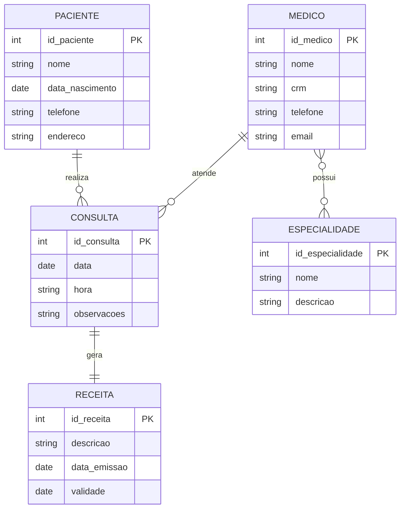

# 🏥 Sistema de Gestão de Clínica Médica

## 1. Introdução
O presente projeto tem como objetivo a elaboração de um modelo conceitual e lógico para o gerenciamento de dados em uma clínica médica. A proposta contempla a definição de entidades, atributos e relacionamentos, assegurando a integridade e consistência das informações.

## 2. Escopo
O sistema visa atender às seguintes necessidades:

- Armazenamento de informações de pacientes e médicos.
- Registro de consultas médicas realizadas.
- Emissão de receitas médicas vinculadas a consultas.
- Associação de médicos às suas respectivas especialidades.

## 3. Entidades e Atributos
As entidades identificadas no modelo são:

- **Paciente**: id_paciente (PK), nome, data_nascimento, telefone, endereco
- **Médico**: id_medico (PK), nome, crm, telefone, email
- **Especialidade**: id_especialidade (PK), nome, descricao
- **Consulta**: id_consulta (PK), data, hora, observacoes
- **Receita**: id_receita (PK), descricao, data_emissao, validade

## 4. Relacionamentos
Foram definidos os seguintes relacionamentos entre as entidades:

- Paciente (1) —— (N) Consulta: um paciente pode realizar diversas consultas.
- Médico (1) —— (N) Consulta: um médico pode atender diversas consultas.
- Consulta (1) —— (1) Receita: cada consulta pode gerar, no máximo, uma receita.
- Médico (N) —— (N) Especialidade: um médico pode possuir várias especialidades e uma especialidade pode estar associada a vários médicos.

## 5. Diagrama Entidade-Relacionamento (DER)

## 6. Tecnologias Utilizadas 
- Linguagem de modelagem: DER (Diagrama Entidade-Relacionamento)
-  Ferramenta de documentação: Markdown
-  Ferramenta de versionamento: Git e GitHub
-  Representação gráfica: Mermaid

## 7. Conclusão 
O modelo proposto possibilita a organização estruturada das informações da clínica médica, assegurando clareza na relação entre entidades e a rastreabilidade dos dados. A modelagem atende ao requisito mínimo de cinco entidades e contempla os três tipos de relacionamentos solicitados: 1:1, 1:N e N:M. 

## 8. Autores 
Isabella Santos Fagundes

Projeto de integração Java + MySQL para a disciplina 

## Como usar

1. Ajuste `src/main/java/br/clinica/db/DBConnection.java` com sua URL, usuário e senha do MySQL.
2. Crie o schema no MySQL usando `sql/clinica_schema.sql` (seu script) e depois rode `sql/inserts_example.sql` para popular dados iniciais.
3. Build com Maven:
   - `mvn clean package`
4. Rode:
   - `java -cp target/clinica_medica_integration-1.0-SNAPSHOT.jar;~/.m2/repository/mysql/mysql-connector-j/8.1.0/mysql-connector-j-8.1.0.jar br.clinica.app.Main`
   (ou use sua IDE e adicione o connector ao classpath)

## O que está incluso
- 5 modelos (Paciente, Medico, Especialidade, Consulta, Receita)
- 5 DAOs completos com CRUD (INSERT, UPDATE, DELETE, SELECT)
- `Main` com menu CLI para todas operações e opções de JOINs solicitados.
